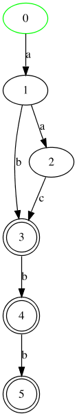

# spbau-formal-languages

Proof of "An intersection of a context-free grammar and an automaton is a context-free
grammar".

### Automaton's format

It is given in
[DOT](https://en.wikipedia.org/wiki/DOT_(graph_description_language)) format. It should
be a digraph. Every edge should be a letter. Node's name is arbitrary.

Initial and final states are represented by node attributes. 
Color a node green for it to be an initial state. "doublecircle" shape represents a final state.

For example:

```
digraph {
    0 [color="green"]
    3 [shape="doublecircle"]
    4 [shape="doublecircle"]
    5 [shape="doublecircle"]

    0 -> 1 [label="a"]
    1 -> 2 [label="a"]
    1 -> 3 [label="b"]
    2 -> 3 [label="c"]
    3 -> 4 [label="b"]
    4 -> 5 [label="b"]
}

```



### Context-free grammar's format

File should follow these guidelines:

* Nonterminal symbols are uppercase letters, terminal symbols are lowercase.

* Empty string is represented by *eps*.

* Initial nonterminal is the symbol in the left part of the first rule.

* Rules are written like that: S: a S b, S: eps.

For example:

```
A: a B b
B: C
B: a B b
C: c C
C: eps
```
